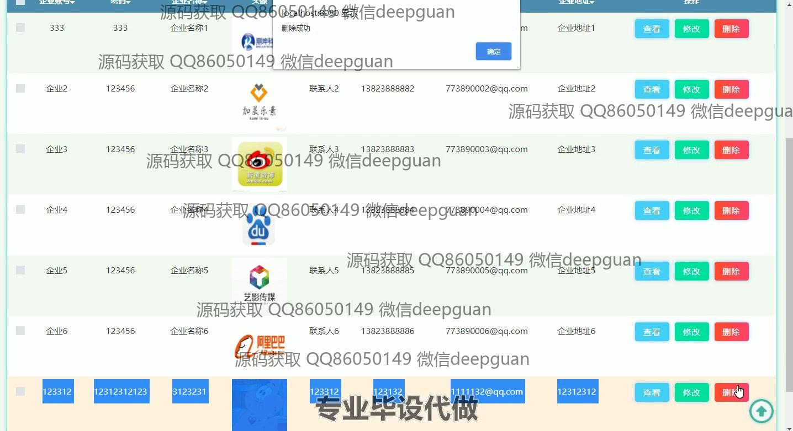

<h1 align="center">基于框架的大学生就业信息平台</h1>

## 简介
大学生就业信息平台，包括用户、企业和管理员功能模块；提供个人中心、招聘资讯、企业信息、论坛交流、职位管理、信息统计等功能，助力用户便捷管理和求职。    --计算机毕业设计源码；毕设源码；java毕业设计源码

## 联系方式

<h3 align="center">获取完整代码与数据库文件 + 微信：deepguan QQ: 86050149 QQ群: 783742310</h3>

<h3 align="center">可帮忙远程部署 包运行成功！提供远程部署、修改代码、设计文档指导、代码讲解等服务！</h3>

## 功能介绍（完整见运行截图）
管理员： 基本功能包括用户和企业的注册、登录及退出，能够管理招聘资讯、用户信息、企业信息和招聘信息。管理员可通过职位分类、招聘人数、招聘时间等管理招聘相关信息，提供先进的搜索与操作功能如查看、修改和删除。此外，还可管理和查看系统中的统计数据，通过图表显示各类招聘数据的分布和变化，为系统的优化提供决策支持。

用户： 支持用户登录、注册和退出基本功能，用户可通过系统更新个人信息，包括联系方式、教育和工作经历等。在个人中心中查看和管理简历信息、应聘信息和面试通知。用户可以浏览平台上发布的招聘信息，与企业及招聘信息进行互动，如申请职位、管理面试邀请、收藏感兴趣的职位，同时还可通过论坛交流功能增强与企业及其他用户的交流互动。

企业： 企业用户可注册和登录平台，以管理企业招聘信息，通过填写职位信息、上传职位图片等丰富招聘信息。管理和查看申请人员的简历及联系信息，通过系统向合适的候选人发送面试邀请。企业还可更新企业信息以及招聘需求，将已发布职位进行修改或删除，确保招聘信息的准确性和时效性，并查看职位申请情况来快速响应合适人才。

## 运行截图

本代码来源于网络,仅供学习参考使用!

